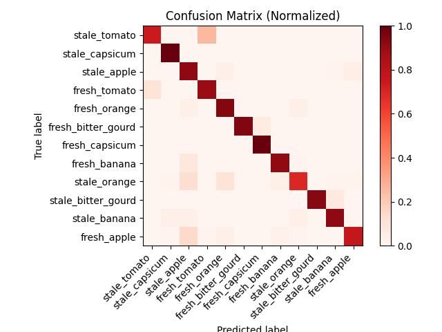

---
# Feel free to add content and custom Front Matter to this file.
# To modify the layout, see https://jekyllrb.com/docs/themes/#overriding-theme-defaults

layout: default
---

# Produce Classification Using Computer Vision

# Background

Since the start of the Agricultural Revolution, technology has fueled many of the advancements in the production, cultivation and management practices of the agricultural industry. Today, as the shrinking number of agricultural workers continues to diminish in the U.S, farmers are once again looking to technology to solve the issues presented to them. The practice of sorting and grading produce at the time of harvest is a great undertaking that requires a lot of time, manual labor and resources. To minimize these constraints, automation is favorable when the task at hand is very mundane and repetitive. Emerging technologies in the field of computer vision, robotics and machine learning have made it possible for this automation to take place. Many Farms across the U.S are already making use of these technologies by supporting automations in the seeding/weeding, harvesting and even fertilization processes. The problem we have decided to take on for our project is in the sorting and grading portion after the harvest, when many laborers and resources are used to sort through the produce. What we wish to solve for this project is the problem of classifying produce as rotten or fresh. We will achieve this through state of the art computer vision and machine learning techniques we have learned in class. We will be using modern methods of computational filtering in order to preprocess the images. This will be important before sending them downstream to our machine learning model to reduce noise and detect edges and boundaries. When applying a machine learning model we will aim to use the latest and most established libraries to further our learning and establish the most accurate results.This process has been previously created and implemented in many farms today, but we wish to understand and possibly even expand on this research, as it would help many Agricultural workers. While we will closely follow past research and methods in order to achieve our goals, this project will give us the opportunity to gain experience using Neural networks, as well as try different computational filters to try and solve this widespread problem. The world population is only growing along with the demand for food, and issues such as these are paramount to the sustainability of the world food supply. By solving this issue we can reduce the manual labor and time required to sort and grade the produce, which will give more time and resources back to the farmer. 

# Our Two Approaches

There are multiple ways to detect stale or rotten produce. Part of why we are using computer vision to solve this problem is because produce has visual impurities when they go stale or rotten.

## Machine Learning Model
Using a dataset of annotated pictures, we could use existing machine learning libraries to train a machine learning model to classify produce. The cited papers below use convolutional neural networks and deep learning to identify visual impurities and classify the produce. Using a free online dataset found on Kaggle.com we can create and train our own model. Foreseen issues with this approach is a lack of training data. Production grade applications of machine learning have training models of tens of thousands of images, whereas our dataset has only about 10,000 images. We could have a model that isn’t accurate enough to be acceptable.

### Gathering and Preprocessing Data
We used a dataset of 14,700 images from Kaggle.com. This dataset has 12 classes, fresh and stale apples, oranges, bananas, gourds, capsicums, and tomatos and To preprocss the data we simply resized the image down to 50 by 50 pixels and normalized the pixel values. We then split the data into a training and testing set with a 95%/5% split.

 Figure 1: The 12 classes of produce in the dataset 

### Convolutional Neural Network
We used the Python library fastai to quickly create a convolutional neural network. We created a model with 2 convolutional layer, 1 fully connected layer, and 2 relu activation functions. 
We used the Stoiastic Gradient Descent optimizer and the Cross Entropy loss function. 

### Results
We trained the model for 5 epochs and achieved an overall accuracy of 88% on the test set. 
The worst performaing produce were stale tomatos and oranges with an accuracy of 71% for those two classes. This is much better than our midterm overall accuracy of 63% and we are confident that we can improve this accuracy with a more refined model.

The best performing classes were fresh and stale capsicum and gourds with 100% accuracy. As the model stands right now 6 out of the 12 classes met our goal of 90% accuracy. Please consult Analysis and Encountered Problems for possible methodologies to improve our model further. Below are the accuracies for each class and confusion matrix for the model.

 Figure 2: The accuracy of the model for each class 

 Figure 3: The confusion matrix for the model 

### Analysis and Encountered Problems
We can see that our model works well with the classes that are very different from each other. The classes that are very similar to each other, such as fresh and stale apples, oranges, and bananas, are the classes that the model struggles with. This is because the model is not able to distinguish between the two classes. This is a problem that must be addressed in future iterations.
The worst performing classes, stale tomatos and oranges, were most confused with the fresh variations of those classes, so our original idea of converting the model to a binary fresh stale classifier would not work. We would need to train a model for each class of produce. This would be a very time consuming process and would require a lots more data.

On top of this, we are also both new to machine learning and the fastai library, so a good amount of time was spent reasearching and learning how to use the library let alone a more efficient and accurate model.

---

## Computational Model
 In our computational model we decided to approach the problem from established methods of using image intensity values to locate rotted regions of our produce. Images obtained from the Kaggle data set as mentioned above, are used as the input data to avoid any biases in terms of obtaining our results. Through a series of filtering, we reduce noise and smaller imperfections that are not considered rotted areas to obtain images that highlight features that are more considerable in size. To further highlight significant areas and reduce noise, morphological operations are used to expand and erode areas defined by a structuring element that is applied on the image. Once this is complete we will have removed small objects from an image, while preserving the shape and size of larger objects in the image. Once the image is filtered, we impose Otsu's algorithm to the filtered image to reconstruct it as a binary image to better segregate the highlighted areas. From here we now have an image that can be better segmented in order to make comparisons between regions of interest. This is done using Blob detection that segments areas based off connected components. Once we have the components we can compare the area of the blogs found in the image to area of the produce. We assign a threshold value that returns whether or not the blobs are significant enough to render the produce as rotten if it surpasses this threshold.  

* **Filtering**

    Produce often has smaller visual impurities that should not be considered as rotted areas, such as speckles, pores and lenticels. To deal with these features we filter and smooth across the whole image to only consider more defining features. Filtering is carried out by a series of methods to denoise and enhance image features in order to obtain an image that can be better segmented downstream in the algorithm. First we blur the image in order to remove any minor imperfections. Then the image contrast is increase to differentiate areas in the image. Then finally, we apply a _12x12_ median filter to the image to further smooth any remaining noise. A median filter was chosen for its ability to denoise images while preserving sharp edges. 

* **Morphology**
    
    Morphology is a broad set of image processing operations that process images based on structuring elements. In a morphological operation, each pixel in the image is adjusted based on the value of other pixels in its neighborhood. In our project we use a disk structuring element with a radius of 5 pixels when considering neighboring pixels. The disk structuring element is used because of its ability to round concave boundaries while preserving the shape of convex boundaries, which is more applicable to fruits and vegetables. The process starts by first eroding the image which removes floating pixels and thin lines so that only substantive objects remain. Next dilation is performed to make the remaining image features more visible and fill in small holes in image. Lines appear thicker, and filled shapes appear larger.
    

* **Segmentation**
    To perform our blob detection downstream we must first convert the image to a binary image for segmentation. First we will apply Otsu's algorithm to define the foreground and background pixels. Otsu's method, works by calculating a threshold value which minimizes the intraclass variance of pixels. when performed it replaces all values above a globally determined threshold with 1s and setting all other values to 0s. Applying this operation turns darker pixels to 0 for false and lighter pixels to 1 for true. The resulting image will turn the background to white and the foreground to black. Since our region of interest lies within the foreground, we must invert the image to capture the produce itself. The final step is segmenting the image by capturing the blob considered to be the produce itself and the blobs considered to be rotted areas or imperfections. We first fill the resulting image which removes the imperfections from the image to get the produce blob. Then we subtract that image from the previous image to obtain the rotted region blobs. Now we have a means of calculating a difference in the image to determine if the imperfections were significant enough to be considered rotten produce. 
 

* **Calculation**
    In order to determine whether the produce is rotted or not we will calculate the area of the fruit and the area of the rotted regions. Once these areas are calculated we divide the area of the rotted regions by the area of the produce to calculate a score that we will compare against a threshold value. If the score exceeds the threshold the produce will be sorted into the rotted produce folder and if not, then sorted into the fresh produce folder.  

 Figure 4: Computational Model Stages 

### Results

    we'll talk...

 
 

 ### Analysis and Encountered Problems

    When starting the project we considered established methods which used the intensity value shifts to find regions of interest based off grayscled images. The main issue with this is that our data from Kaggle had substantial background noise and objects that manipulated the way blob detection was performed. In the established methods this project was adapted from, images were taken from a conveyer belt which provided a uniform background which would compensate for this issue. Additionally, the images were taken using differnt lightingn conditions that were not uniform and added glare to the images when light reflected off the vegitables. This created false positives for rotted regions in the image and returned the produce as rotten when it should have been fresh. In the established methods, images were taken from light that passed through a polorized filter to reduce glare and increase image quality and contrast. When inputing images not apart of the kaggle dataset, results were greatly improved when using highier quality images. 

dont know if need this now?
 However this approach would only work for produce that has significantly discolored spots. Another method could be to compare brightness of the pixels of the object compared to the brightness of the background to find a pale, washed out color found on stale tomatoes, apples, and other red produce. A problem with this approach is that it’s unknown how this method would apply to other colored produce. A combination of the above with a voting system could give an accurate classification on if a produce is imperfect or not.

---

## Decision
It's not unfair to say that neural networks are a buzzword nowadays. You can see machine learning being thrown into a vast majority of computer vision projects being released. To test if we really needed to utilize machine learning for this particualar project, we decided to do a two pronged approach and test the two. We'll be evaluating the complexity that went into each approach and the accuracy of each approach.

The neural network approach had a steep learning curve. But once we got the hang of it, we were able to get a model up and running in a few hours. The bulk of our time was spent on data preprocessing and fine tuning the model layers. It's performance was overall very good as explained above with an overall accuracy of 90%. There is room for improvement and clear starting points to do so given more time.

The computational method had far more challenges. The learning curve was not as steep as the comptational filters of edge detection to find pronounced blemishes and using color intensity to find discoloration in produce were introductory concepts from the beginning of class.
However the random nature of rotten produce proved difficult to integrate these filters into one standalone pipeline. It ended with us not being able to get very accurate results out of it.

We decided that a machine learning approach was the way to go for this use case because of the random nature of how produce decays and how machine learning allowed us to "black box" all the filtering and detection of blemishes and discoloration.

## Timeline
| Milestone                                                                                      	| Date          	|
|------------------------------------------------------------------------------------------------	|---------------	|
| Project proposal due                                                                           	| October 6th   	|
| Begin machine learning model creation, download dataset                                        	| October 10th  	|
| Determine computational filters to use for computational methodology                           	| October 16th  	|
| Submit midterm report with current machine learning model and computational filtering progress 	| November 9th  	|
| Determine more accurate methodology and draw conclusions                                       	| November 25th 	|
| Final presentation completed                                                                   	| December 6th  	|
| Final project website completed                                                                	| December 9th  	|A

## Resources Materials and Cites
* [Kaggle.com](https://www.kaggle.com/sriramr/fruits-fresh-and-rotten-for-classification) - Dataset used for machine learning model

* [iopscience.iop.org](https://iopscience.iop.org/article/10.1088/1742-6596/1952/2/022048/pdf) - The computational model is a variation based on the ideas of the Wuhan University of Technology's methods. 